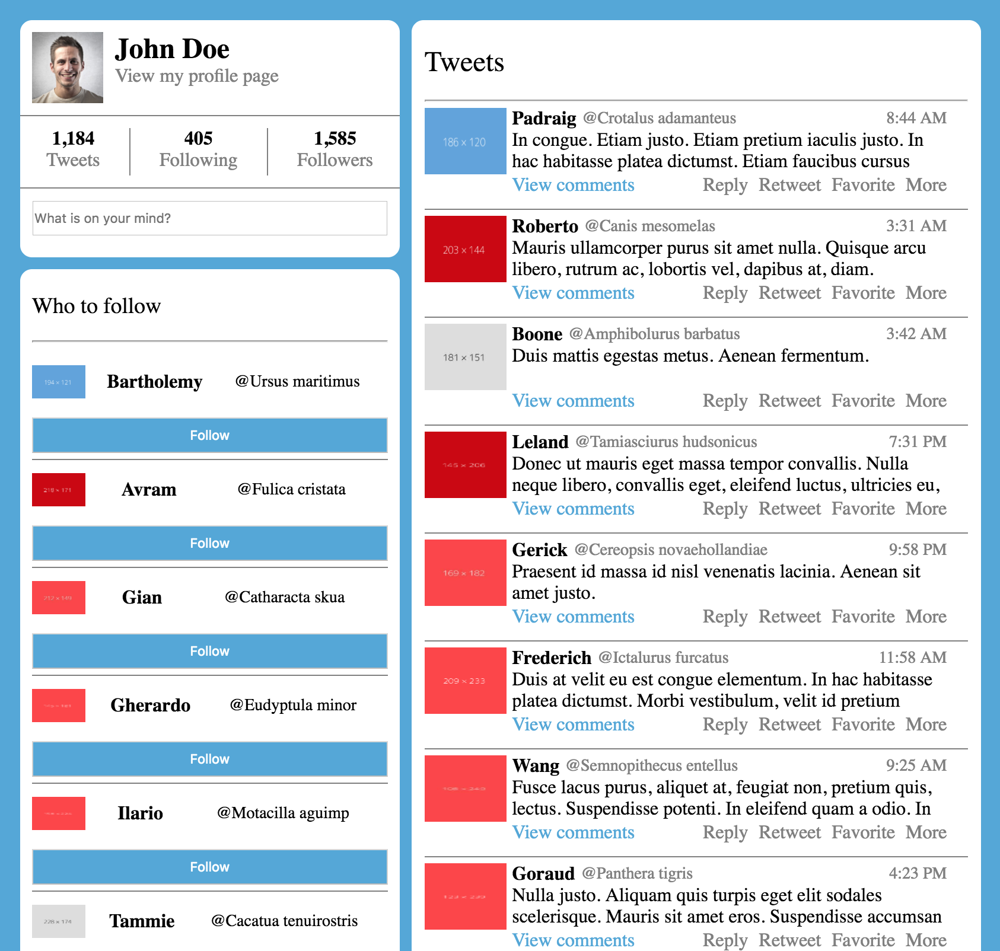

# Упражнение Handlebars

## Инсталация
- Ако все още не сте - инсталирайте [NodeJS + npm](https://nodejs.org/en/)
- Клонирайте / изтеглете този проект
- Влезте в директорията и напишете `npm install` в конзолата ви
- След като инсталирането на пакети приключи напишете `npm run serve`

## Задача
Направте приложение, което да прилича на страница на twitter използвайки Handlebars.js

## За приключилите първи (*)
- Направете страницата да минава в една колона, когато екрана се смали и текстовете станат нечетими
- Имплементирайте функционалност, чрез която когато напишете нещо в полето за вашите Tweet - ове и натиснете Enter вашият Tweet излиза като първи tweet в секцията в дясно
- ... `За смелите` - Прочетете как работи `npm` и как да си направите `build` за вашето Web приложение, като след това require - нете Handlebars във вашия script.
    - [Webpack](https://webpack.github.io/)
    - [Browserify](http://browserify.org/)

## Ресурси
- В папката `data` сме поставили данни, които са нужни за страницата
- Използвайте [Fetch API](https://developer.mozilla.org/en-US/docs/Web/API/Fetch_API/Using_Fetch), за да вземате темплейтите от `template` папката, както и данните от `data`
- [Handlebars](http://handlebarsjs.com/)
- За да построите страницата може да използвате и Boostrap, но нашето решение е с чист `CSS`
